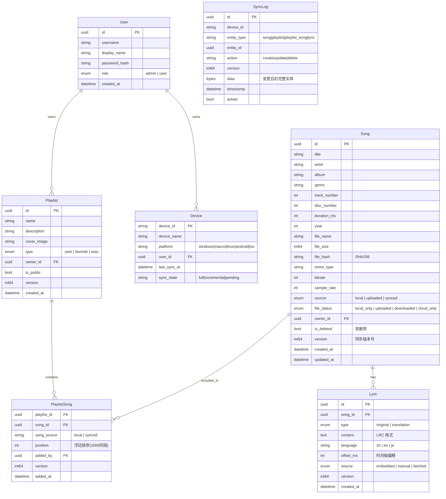

# 音匣（EchoVault）架构设计文档

> 版本：v1.0  
> 日期：2026-06-30  
> 状态：草案

---

## 1. 项目概述

### 1.1 定位

音匣（EchoVault）是一个**混合模式音乐管理平台**，支持：
- **本地音乐管理** — 扫描本机音频文件，建立离线曲库
- **云端曲库同步** — 多设备间同步歌曲元数据、歌词、歌单
- **文件发布共享** — 用户可手动上传音频文件到服务器，供其他设备使用

### 1.2 部署模式

- **起步**：家庭自托管（单机 Docker Compose）
- **预留**：架构支持未来扩展为 SaaS 多租户服务

### 1.3 目标用户

家庭 / 小团队（几个用户），各自管理自己的设备。

---

## 2. 系统架构

### 2.1 架构风格

**离线优先的边缘架构（Offline-First Edge Architecture）**

- 每个 Flutter 客户端是"一等公民"，离线时可独立运行全部功能
- Go 后端作为**轻量同步中枢**，负责多设备间的数据同步和文件交换
- 客户端优先读写本地 SQLite，网络恢复后自动增量同步

### 2.2 架构总览

```
┌──────────────────────────────────────────┐
│            Flutter 客户端（全平台）          │
│  ┌──────────┐  ┌──────────┐              │
│  │  SQLite   │  │ 本地文件   │              │
│  │  (drift)  │  │ 扫描器    │              │
│  └────┬─────┘  └──────────┘              │
│       │ 离线优先读写                        │
│  ┌────▼─────┐                             │
│  │ Services │  gRPC/REST                  │
│  └──────────┘                             │
└──────────────────┬────────────────────────┘
                   │
                   ▼
┌──────────────────────────────────────────┐
│           Envoy Proxy (gRPC-Web)          │
│  HTTP/1.1 ↔ HTTP/2 协议转换              │
└──────────────────┬────────────────────────┘
                   │
          ┌────────┴────────┐
          │                  │
   gRPC Unary/Stream        REST
          │                  │
          ▼                  ▼
┌──────────────────┐  ┌──────────────────┐
│  Go 同步服务器    │  │  REST 文件服务     │
│                   │  │                  │
│  - SyncService    │  │  - 分段上传       │
│  - UserService    │  │  - 文件下载       │
│  - SongService    │  │  - 封面/歌词      │
│  - PlaylistService│  │                   │
│  - LyricService   │  └──────────────────┘
│                   │
│  内部使用 Ent +   │
│  SQLite (默认)    │
│  / PostgreSQL     │
└──────────────────┘
```

### 2.3 通信协议

| 用途 | 协议 | 模式 |
|:---|:---|:---|
| CRUD 操作（用户/歌曲/歌单/歌词） | gRPC | Unary |
| PushChanges — 提交本地变更 | gRPC | Unary（一次性批量提交） |
| PullChanges — 拉取远程增量变更 | gRPC | Server Stream |
| SubscribeChanges — 实时变更通知 | gRPC | Server Stream |
| 文件上传/下载（大文件二进制） | REST | 分段上传 / 范围请求 |

---

## 3. 数据模型

### 3.1 核心实体



### 3.2 服务端 DB（SQLite→Ent）

使用 [ent](https://entgo.io/) 作为 ORM 进行 schema 管理和代码生成。默认使用 SQLite，支持未来切换到 PostgreSQL。

关键 schema 文件：
- `internal/ent/schema/user.go`
- `internal/ent/schema/song.go`
- `internal/ent/schema/lyric.go`
- `internal/ent/schema/playlist.go`
- `internal/ent/schema/playlist_song.go`
- `internal/ent/schema/device.go`
- `internal/ent/schema/sync_log.go`

### 3.3 客户端 DB（SQLite→drift）

Flutter 端使用 [drift](https://drift.simonbinder.eu/)（原 moor）作为 SQLite ORM，schema 与服务端保持一致，但增加本地专用字段：

| 字段 | 用途 |
|:---|:---|
| `sync_status` | pending / synced / conflict |
| `local_path` | 本地音乐文件绝对路径 |
| `is_downloaded` | 云端歌曲是否已离线缓存 |
| `last_played_at` | 本设备播放时间 |
| `play_count` | 本设备播放次数 |


### 3.4 文件存储设计

#### 3.4.1 存储内容分类

| 数据类型 | 大小 | 客户端存储 | 服务端存储 | 传输协议 |
|:---|:---:|:---|:---|:---:|
| **音频文件** | 大（3-50MB） | 原始路径（本地扫描）/ 应用缓存目录（离线下载） | `STORAGE_PATH/songs/{song_id}/{filename}` | REST 分段上传 / Range 范围下载 |
| **封面图片** | 中（10-500KB） | 应用缓存目录 `{cacheDir}/covers/{song_id}.jpg` | `STORAGE_PATH/covers/{song_id}.jpg` | REST 下载（带缓存头） |
| **歌词文本** | 小（1-10KB） | SQLite `lyric.content` 字段 | SQLite / PostgreSQL `lyrics.content` 字段 | gRPC Unary |

#### 3.4.2 客户端存储策略

**本地扫描的音乐文件：**
- 存储在用户原始路径（如 `/Music/周杰伦-晴天.mp3`）
- 客户端记录 `song.local_path` 指向原始路径
- 不复制、不移动用户文件

**从服务端离线缓存的文件：**
- 存储在应用私有目录 `{appDir}/cache/audio/{song_id}/{filename}`
- 用户手动点击「下载到本地」时触发
- 支持批量下载

**封面缓存：**
- 存储在 `{appDir}/cache/covers/{song_id}.jpg`
- 首次从服务端下载后缓存，后续优先读本地缓存
- 支持缓存过期/清理机制

**歌词：**
- 直接存储在本地 SQLite 的 `lyrics` 表中
- 与服务端 gRPC GetLyric 同步

#### 3.4.3 服务端存储策略

**存储后端抽象（`pkg/storage`）：**

```go
// pkg/storage/storage.go
type Storage interface {
    SaveAudio(ctx context.Context, songID uuid.UUID, filename string, reader io.Reader) error
    GetAudio(ctx context.Context, songID uuid.UUID) (io.ReadCloser, int64, error)
    SaveCover(ctx context.Context, songID uuid.UUID, reader io.Reader) error
    GetCover(ctx context.Context, songID uuid.UUID) (io.ReadCloser, int64, error)
    DeleteSongFiles(ctx context.Context, songID uuid.UUID) error
}
```

**默认实现—本地文件系统（`STORAGE_TYPE=local`）：**

```
data/files/
├── songs/
│   ├── {song_id}/
│   │   └── 晴天.mp3
│   └── {song_id}/
│       └── 七里香.flac
└── covers/
    ├── {song_id}.jpg
    └── {song_id}.png
```

**未来实现—S3 兼容（`STORAGE_TYPE=s3`）：**

```
bucket: echovault
  Key: songs/{song_id}/{filename}
  Key: covers/{song_id}.jpg
```

**文件上传/下载 REST API：**

```http
### 上传音频文件（分段上传）
POST /api/v1/files/upload?type=audio&song_id={id}
Content-Type: multipart/form-data; boundary=xxx
→ 200 { "file_url": "/api/v1/files/download/audio/{id}", "file_size": 8421309 }

### 下载音频文件（支持 Range 头，用于流式播放和拖动进度条）
GET /api/v1/files/download/audio/{id}
Range: bytes=0-1023
→ 206 Partial Content
Content-Range: bytes 0-1023/8421309

### 上传封面
POST /api/v1/files/upload?type=cover&song_id={id}
Content-Type: multipart/form-data; boundary=xxx
→ 200 { "cover_url": "/api/v1/files/download/cover/{id}" }

### 下载封面
GET /api/v1/files/download/cover/{id}
→ 200 (带 Cache-Control: public, max-age=86400)

### 删除（发布者撤销）
DELETE /api/v1/files/{type}/{id}
```

#### 3.4.4 文件完整流转路径

```
┌────────── 客户端 A（扫描/发布）──────────┐
│                                          │
│  扫描 /Music 目录                          │
│    → 发现 周杰伦-晴天.mp3                   │
│    → SHA256=abc123                        │
│    → 写入本地 SQLite                       │
│      song.id = uuid_v7                    │
│      song.local_path = /Music/周杰伦-晴天  │
│      song.file_status = LOCAL_ONLY        │
│                                          │
│  用户手动发布：                              │
│    → POST /upload?type=audio&id={id}      │
│      → 服务端存到 songs/{id}/晴天.mp3       │
│    → POST /upload?type=cover&id={id}      │
│      → 服务端存到 covers/{id}.jpg          │
│    → gRPC SaveLyric(LRC内容)              │
│      → 服务端写入 lyrics 表                │
│    → song.file_status → UPLOADED          │
│                                          │
└──────────────────────────────────────────┘

┌────────── 客户端 B（同步/离线）────────────┐
│                                          │
│  PullChanges → 发现新歌 abc123            │
│    → 本地 SQLite 写入元数据                │
│    → 下载封面 → cache/covers/{id}.jpg     │
│    → 下载歌词 → 写入本地 lyrics 表          │
│    → 音频不下载（file_status=CLOUD_ONLY）  │
│                                          │
│  用户点击「播放」（在线流式）:                │
│    → GET /download/audio/{id} (带 Range) │
│    → just_audio 流式解码播放               │
│                                          │
│  用户点击「下载离线」:                      │
│    → GET /download/audio/{id}             │
│    → 存到 cache/audio/{id}/晴天.mp3       │
│    → file_status → DOWNLOADED            │
│    → 离线可播放                           │
│                                          │
└──────────────────────────────────────────┘
```


## 4. 同步引擎设计

### 4.1 核心流程

```
设备A (离线修改)             EchoVault Server             设备B
     │                             │                        │
     │ ① 写本地 SQLite +           │                        │
     │   记录 SyncLog(pending)      │                        │
     │                             │                        │
     │ ── 网络恢复 ──               │                        │
     │                             │                        │
     │ ② PushChanges(batch) ──────►│                        │
     │                             │ ③ 更新 Server DB       │
     │                             │ ④ 记录变更到队列        │
     │                             │                        │
     │ ◄───────────────────────────┤ ⑤ SubscribeChanges      │
     │                             │    推送通知              │
     │                             │                        │
     │ ⑥ PullChanges(since_v) ◄───►│ ◄──────────────────────│ ⑥ PullChanges
     │                             │                        │
     │ ⑦ 合并到本地 SQLite          │             ⑦ 合并到本地│
     │ ⑧ AckChanges                │             ⑧ Ack     │
```

### 4.2 冲突解决策略

| 场景 | 策略 | 说明 |
|:---|:---|:---|
| 不同字段修改 | 字段级合并 | 以每个字段最新 version 为准 |
| 同字段修改 | LWW（Last-Write-Wins） | version 大的胜出，被覆盖的记入本地冲突日志 |
| 删除 vs 修改 | 删除优先 | 已删除实体忽略后续修改，通知修改方 |
| 歌单排序 | 浮动位置合并 | 使用 1000 间隔，极少产生真正的排序冲突 |
| 文件双版本 | 保留双版本 | 不同 hash 视为不同版本，用户可手动选择 |

### 4.3 gRPC SyncService Proto

```protobuf
service SyncService {
    // Push: Unary — 联网后一次性提交本地变更
    rpc PushChanges(PushRequest) returns (PushResponse);

    // Pull: Server Stream — 拉取增量变更
    rpc PullChanges(PullRequest) returns (stream SyncChange);

    // Subscribe: Server Stream — 实时推送通知
    rpc SubscribeChanges(SubscribeRequest) returns (stream ChangeNotification);
}

message PushRequest {
    string device_id = 1;
    int64  last_pull_version = 2;
    repeated SyncChange changes = 3;
}

message PullRequest {
    string device_id = 1;
    int64  since_version = 2;
}

message SubscribeRequest {
    string device_id = 1;
}
```

---

## 5. 本地文件策略

### 5.1 核心原则

1. **所有上传都是手动的** — 用户决定何时将歌曲"发布"到服务器
2. **服务端是元数据权威来源** — 即使本地文件标签有误，GUI 优先展示服务端数据
3. **Hash 去重跨设备** — SHA256 是唯一标识，相同 hash 自动关联

### 5.2 扫描流程

```
扫描 /Music 目录
    │
    ▼
计算 SHA256 hash（全部音频文件）
    │
    ▼
批量查询服务端：CheckSongsByHash(hashes)
    │
    ├── hash 已存在 → 下载服务端元数据 + 封面 + 歌词
    │                 → 写入本地 SQLite
    │                 → GUI 优先展示服务端信息
    │
    └── hash 不存在 → 本地保留记录
                      → UI 显示"未发布"
                      → 仅本设备可见
                      → 用户可手动选择发布
```

### 5.3 发布流程

用户手动选择一首或多首本地歌曲 → 点击「发布到服务器」：

```
① 可选编辑元数据（标题/歌手/专辑等）
② 可选上传封面图片
③ 可选上传/编辑 LRC 歌词
④ 上传音频文件（REST 分段上传）
⑤ 服务端收录，成为权威数据源
⑥ 其他设备通过同步获得该歌曲信息
```

### 5.4 Song 消息扩展

```protobuf
message Song {
    // ...元数据字段...
    FileSource source = 10;     // LOCAL | UPLOADED | SYNCED
    FileStatus file_status = 11; // LOCAL_ONLY | UPLOADED | DOWNLOADED | CLOUD_ONLY
    string local_path = 12;     // 仅本地使用，不同步
}
```

---

## 6. 后端设计

### 6.1 技术栈

| 组件 | 技术 |
|:---|:---|
| 语言 | Go 1.23+ |
| gRPC 框架 | google.golang.org/grpc |
| Protobuf | google.golang.org/protobuf |
| ORM | entgo.io/ent |
| 数据库驱动 | SQLite (mattn/go-sqlite3) / PostgreSQL (pgx) |
| JWT 认证 | golang-jwt/jwt/v5 |
| 音频元数据 | dhowden/tag |
| 配置管理 | spf13/viper |

### 6.2 项目结构

```
echovault-server/
├── cmd/server/main.go
├── api/
│   ├── grpc/
│   │   ├── proto/echo_vault/{user,song,playlist,lyric,sync}/v1/
│   │   └── generated/
│   └── rest/handler/{upload,download}.go
├── internal/
│   ├── domain/          # 领域模型
│   ├── ent/             # Ent schema + 生成代码
│   ├── service/         # 业务逻辑
│   │   ├── user_service.go
│   │   ├── media_service.go
│   │   ├── playlist_service.go
│   │   ├── lyric_service.go
│   │   └── sync_service.go
│   └── middleware/      # auth, logging
├── pkg/
│   ├── config/
│   ├── storage/         # local / s3 抽象
│   └── sync/            # 冲突检测、版本管理
├── go.mod
├── Dockerfile
└── docker-compose.yml   # echovault-server + envoy
```

### 6.3 服务模块职责

| 模块 | 职责 | DB |
|:---|:---|:---|
| `sync_service` | 同步协调：版本追踪、变更队列、冲突检测 | SQLite |
| `user_service` | 注册/登录、JWT 签发、设备管理 | SQLite |
| `media_service` | 歌曲元数据管理、hash 查询、搜索 | SQLite |
| `playlist_service` | 歌单 CRUD、排序 | SQLite |
| `lyric_service` | LRC 歌词存储/检索 | SQLite |
| `storage` | 文件存储抽象（local FS / S3） | 文件系统 |

---

## 7. 前端设计

### 7.1 技术栈

| 组件 | 技术 |
|:---|:---|
| 语言 | Dart 3.x |
| 框架 | Flutter 3.x |
| 目标平台 | Android / iOS / Windows / macOS / Linux / Web |
| 状态管理 | Riverpod |
| 本地数据库 | drift (SQLite ORM) |
| gRPC | grpc-dart + protobuf |
| REST | dio |
| 音频播放 | just_audio |
| 路由 | go_router |

### 7.2 项目结构

```
echo_vault_app/
├── lib/
│   ├── main.dart
│   ├── app.dart
│   ├── core/
│   │   ├── grpc/          # 客户端管理 + 同步引擎
│   │   ├── rest/          # 文件上传/下载
│   │   ├── db/            # drift DAO
│   │   ├── sync/          # 同步引擎核心
│   │   └── config/
│   ├── models/generated/  # protobuf 生成
│   ├── services/          # 业务服务
│   ├── providers/         # Riverpod 状态
│   ├── features/          # 页面
│   │   ├── auth/
│   │   ├── library/
│   │   ├── playlist/
│   │   ├── player/
│   │   ├── scanner/
│   │   └── settings/
│   └── widgets/
├── proto/                 # 与服务端共享
├── test/
└── pubspec.yaml
```

### 7.3 数据流

```
用户操作 → Services（优先读/写本地 SQLite）
                           ↓
                  标记 sync_status = pending
                           ↓
                联网后 SyncEngine 推送到服务器
                           ↓
                其他设备通过 Subscribe 获得通知
                           ↓
                其他设备 PullChanges 拉取增量
```

### 7.4 GUI 渲染优先级

```
渲染歌曲信息时：
  服务端数据（最高优先） > 本地已发布信息 > 文件原生标签（fallback）
```

---

## 8. 部署方案

### 8.1 Docker Compose

```yaml
version: "3.8"
services:
  envoy:
    image: envoyproxy/envoy:v1.32-latest
    ports: ["8080:8080"]
    volumes: ["./envoy.yaml:/etc/envoy/envoy.yaml"]

  echovault-server:
    build: .
    ports: ["9090:9090"]    # gRPC 内部
    volumes:
      - ./data:/data        # SQLite + 文件存储
    environment:
      DB_DRIVER: sqlite3
      DB_PATH: /data/echovault.db
      STORAGE_TYPE: local
      STORAGE_PATH: /data/files
      JWT_SECRET: ${JWT_SECRET}
```

### 8.2 系统要求

- Docker Engine 24+
- 内存：≥ 256MB（Server）/ ≥ 2GB（Flutter Desktop）
- 磁盘：取决于曲库大小

---

## 9. 开发路线图

> 策略：先完成全部 Go 后端服务，再统一开发 Flutter 前端。
> 当前进度：Phase 1-4 已完成（Go 后端基础设施 + 用户系统 + 同步引擎 + 歌曲库）。

### 后端（Go） — 已完成

| Phase | 内容 | 测试 |
|:---:|:---|:---:|
| **1** | 项目脚手架、Ent Schema、gRPC 框架、Envoy 代理、Docker Compose | 16 |
| **2** | JWT 工具包、UserService、DeviceService、AuthInterceptor | 14 |
| **3** | VersionTracker、ChangeLogger、ConflictResolver、Notifier、SyncService、gRPC SyncHandler | 21 |
| **4** | SongService、CheckSongsByHash、Gin REST 文件服务、gRPC SongHandler | 12 |

### 后端（Go） — 待完成

#### Phase 5a：歌词 + 歌单（2周）
| Task | 测试 | 说明 |
|:---:|:---:|:---|
| LyricService | 6 | 歌词 CRUD（多语言/多类型） |
| PlaylistService | 6 | 歌单 CRUD + 歌曲编排 |
| gRPC Handlers | 4 | LyricHandler + PlaylistHandler |

#### Phase 5b：文件元数据扫描 + 音频元数据解析（1周）
| Task | 测试 | 说明 |
|:---:|:---:|:---|
| 音频元数据解析器 | 6 | pkg/metadata，解析 MP3/FLAC 标签 |
| 扫描服务集成 | 2 | gRPC 接口暴露元数据 |

### 前端（Flutter） — 统一开发

#### Phase 6：Flutter 应用框架（2周）
| Task | 说明 |
|:---:|:---|
| Flutter 项目初始化 | drift、grpc-dart、dio、Riverpod 配置 |
| gRPC-Web 客户端封装 | JWT 拦截器、自动重连 |
| drift 本地数据库 | 离线优先数据层 |
| 认证模块 | 登录/注册页面、Token 管理 |

#### Phase 7：歌曲库 + 扫描器 UI（2周）
| Task | 说明 |
|:---:|:---|
| 本地文件扫描器 | dart:io 递归扫描、SHA256、元数据提取 |
| 歌曲列表/搜索 | 瀑布流、搜索栏、排序筛选 |
| 歌曲发布流程 | 编辑元数据、上传封面、上传歌词 |

#### Phase 8：播放器 + 歌词（2周）
| Task | 说明 |
|:---:|:---|
| just_audio 集成 | 播放/暂停/seek、后台播放 |
| LRC 歌词同步 | 时间轴匹配、逐行高亮 |
| 迷你播放器 | 底部悬浮条 |
| 全屏播放页 | 封面 + 歌词 + 进度条 + 歌单队列 |

#### Phase 9：歌单 + 设备管理（1周）
| Task | 说明 |
|:---:|:---|
| 歌单管理 | 创建/编辑/排序/分享 |
| 多设备管理 | 设备列表、同步状态指示 |
| 同步状态 UI | Push/Pull 进度、冲突提示 |

#### Phase 10：部署 + 收尾（1周）
| Task | 说明 |
|:---:|:---|
| 部署文档 | Docker Compose、环境变量、首次配置 |
| 使用文档 | 用户手册、FAQ |
| 端到端测试 | 完整流程验证 |

**预计剩余工期：8-11 周**
（后端 Phase 5：2-3 周 + 前端 Phase 6-10：6-8 周）

---

## 10. 附录

### 10.1 关键依赖清单

**Go 后端：**
- `google.golang.org/grpc` — gRPC 框架
- `google.golang.org/protobuf` — Protobuf
- `entgo.io/ent` — ORM
- `github.com/mattn/go-sqlite3` — SQLite 驱动
- `github.com/golang-jwt/jwt/v5` — JWT
- `github.com/dhowden/tag` — 音频元数据解析
- `github.com/spf13/viper` — 配置管理

**Flutter 前端：**
- `grpc` — gRPC 客户端
- `protobuf` — Protobuf 序列化
- `drift` — SQLite ORM
- `flutter_riverpod` — 状态管理
- `just_audio` — 音频播放
- `dio` — REST 文件传输
- `go_router` — 路由
- `freezed` — 不可变数据模型

### 10.2 架构备选方案

| 方案 | 适用场景 | 不选理由 |
|:---|:---|:---|
| 模块化单体 | 大多数项目 | 离线能力不足 |
| 全微服务 | 大型团队 | 对自托管过度设计 |
| **离线优先边缘架构（选定）** | **多设备 + 离线场景** | **当前最优解** |

---

## 11. gRPC API 定义

### 11.1 Proto 项目结构

所有 proto 文件位于项目根目录 `proto/`，使用 Buf 管理：

```
proto/
├── buf.yaml                    # 模块配置 + 依赖声明
├── buf.gen.yaml                # 代码生成配置（Go + Dart）
├── echo_vault/
│   ├── common/v1/
│   │   └── types.proto         # UUID、分页、FileSource、FileStatus
│   ├── user/v1/
│   │   └── user_service.proto  # 用户注册/登录/设备管理
│   ├── song/v1/
│   │   └── song_service.proto  # 歌曲 CRUD/hash查询/发布
│   ├── playlist/v1/
│   │   └── playlist_service.proto # 歌单 CRUD/歌曲编排
│   ├── lyric/v1/
│   │   └── lyric_service.proto # 歌词 CRUD/搜索
│   └── sync/v1/
│       └── sync_service.proto  # 同步引擎核心协议
```

### 11.2 服务清单

| 服务 | 协议 | 关键 RPC |
|:---|:---:|:---|
| **UserService** | gRPC Unary | Register, Login, RefreshToken, RegisterDevice, ListDevices |
| **SongService** | gRPC Unary | **CheckSongsByHash**, **PublishSong**, ListSongs, SearchSongs |
| **PlaylistService** | gRPC Unary | CreatePlaylist, AddSong, RemoveSong, ReorderSongs |
| **LyricService** | gRPC Unary | GetLyric, SaveLyric, SearchLyric |
| **SyncService** 🔄 | gRPC Mixed | PushChanges(Unary), PullChanges(Stream), SubscribeChanges(Stream) |

### 11.3 生成代码

```bash
# 安装 Buf CLI（已预装）
# 生成 Go + Dart 代码
cd proto && buf generate
```

生成路径：
- **Go**: `echovault-server/api/grpc/generated/`
- **Dart**: `echo_vault_app/lib/models/generated/`
